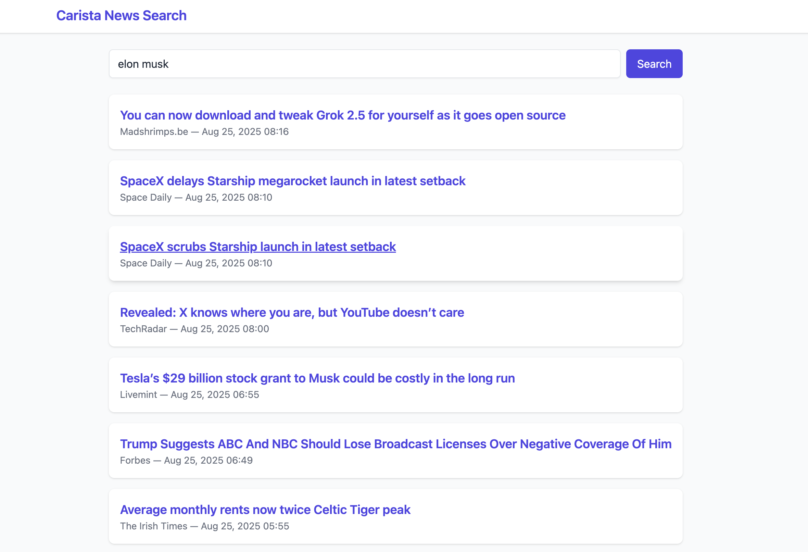
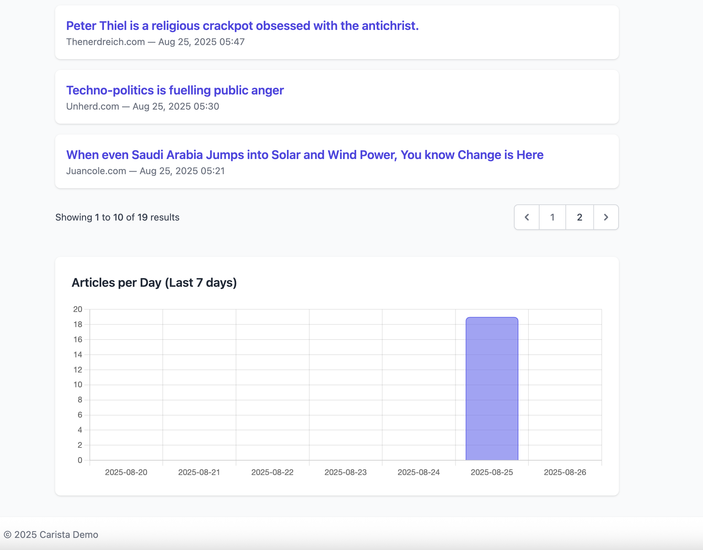

# News Application Integration

A small web-based application built with **Laravel 12** for interview purposes.  
The app integrates with a **3rd-party API** to display various news articles.

## Features

- A **search form** that fetches a maximum of 20 articles per keyword.
- **Paginated results**.
- **Raw data storage** in the database.
- **Rate limiting**: maximum of 20 requests per minute to prevent abuse.
- **Chart visualization** of results per keyword and date for a week.
- Calls the 3rd-party API **only if no match exists** from previous searches.
    - Could be improved with a **cron job** to periodically prune old results.
- **Redis caching**: avoids database queries if a recent search already exists.

---



## How to Set Up

1. Copy `.env.example` into `.env`.
2. Add your private key to `NEWSAPI_KEY=` in the `.env` file.
3. Install Laravel Sail (development dependency):
   ```bash
   composer require laravel/sail --dev
4. Install Sail with your preferred stack (e.g., MySQL):
    ```bash
   php artisan sail:install --with=mysql
5. Start Docker containers:
   ```bash 
   ./vendor/bin/sail up -d
6. Access MySQL:
     ```bash
    ./vendor/bin/sail mysql -u sail -ppassword

7. Create the database if not exist. You can specify whatever name you want but it should be added into Db connection config as well:
    ```bash
   CREATE DATABASE IF NOT EXISTS laravel;
   EXIT;
8. Log into the Docker container (sail-8.4/app).
9. Run migrations:
   ```bash
   php artisan migrate
   npm install
   npm run dev
10. Generate the application key if not already generated:
    ```bash
    php artisan key:generate
11. Run tests:
    ```bash
    php artisan test


